# Widora How-To

`by zymxjtu`

## How-To OpenWrt C/C++ Development with Eclipse

## 1 Copyright
This How-To guide is based on the work of OpenWrt C/C++ Devopement with Eclipse by J.Kohler. Update and add some additional content.

This work is licensed under the Creative Commons Attribution-ShareAlike 3.0 Unported License. To view a copy of this license, visit http://creativecommons.org/licenses/by-sa/3.0/ or send a letter to Creative Commons, 444 Castro Street, Suite 900, Mountain View, California, 94041, USA.

## 2 Revision history
| Revision | Date |Author | Changes |
|--------|--------|--------|--------|
|    v0.1    |    6 Aug 2016    |   zymxjtu    |    First draft    |

## 3 Introduction
With Eclipse, we are able to develop software for OpenWrt target devices in a very comfortable manner. Eclipse provides a complete development suite.

This document explains how to use Eclipse C/C++ IDE with OpenWrt's cross toolchain, how to setup remote target device source level debugging and remote access via eclipse.

It is shown how to write, compile and debug programs for OpenWrt target devices.
We can use Eclipse to develop software for OpenWRT target device.

## 4 Preparation

### 4.1 Prerequisites

#### 4.1.1 Target Prerequisites
The following packages are required on your target device:
1. DropBear or OpenSSH installed & connections can be established
2. openssh-sftp-server
3. gdbserver
4. libstdcpp (optional for C++)

openssh-sftp-server and gdbserver can be pre-build inside the OpenWRT image. If they are not, can simply install them:
1. SSH to OpenWRT. (Or for Widora, use onboard Serial Terminal, check `"Widora_User_Guide_1_Before_Getting_Started"`)
2. Execute `opkg update` and then `opkg install libstdcpp`
3. Execute `opkg update` and then `opkg install openssh-sftp-server`
4. Execute `opkg install gdbserver` to install gdbserver.

  

  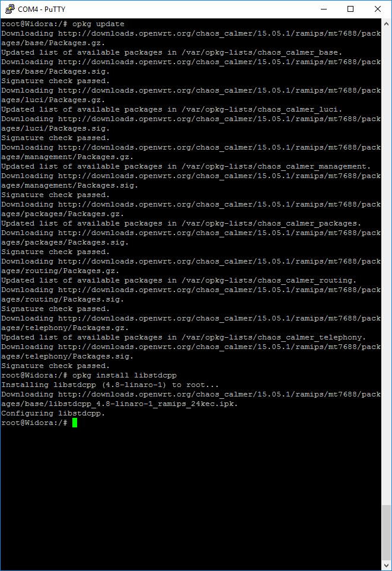

For Widora, in the case that Widora is connect to an AP(Router), and our host computer is also connected to the same AP and not connected to Widora directly, and in order to be able to SSH to Widora remotely, instead of directly SSH to Widora default 192.168.1.1, we need to modify Widora configuration file `/etc/config/firewall` to unblock it. Modify config zone wan, set option input to `ACCEPT`, instead of `REJECT`, and after saving the modification, reboot the Widora:

Original:

  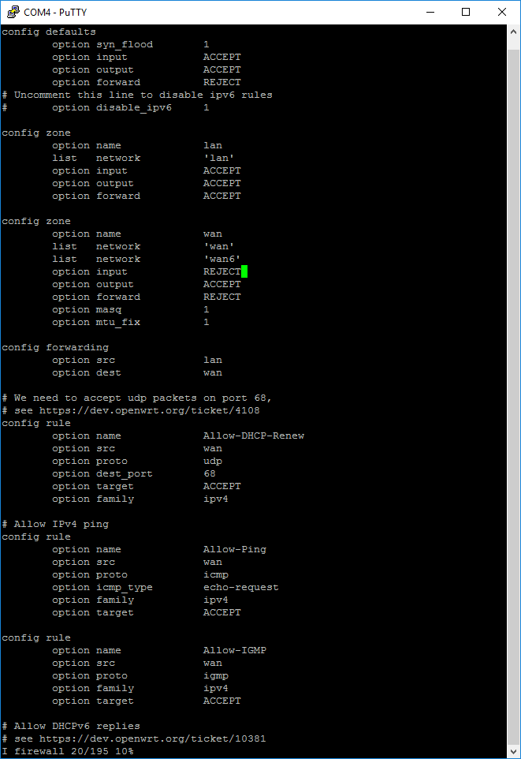

Modified:

  

And verified it (SSH to Widora(192.168.8.180 in this case) remotely):

  


#### 4.1.2 OpenWRT Prerequisites

Install OpenWrt Buildroot:

https://github.com/widora/openwrt_widora

http://wiki.openwrt.org/doc/howto/buildroot.exigence

For OpenWrt Chaos Calmer which Widora is using, there is one isse with the gdb, detailed information here:

https://dev.openwrt.org/ticket/22360

https://dev.openwrt.org/changeset/46298/trunk/toolchain/gdb

This issue will cause below problem when try to debug the user program:

  

So for Widora, there is one modification need for the file `{Widora_Source_Dir}/toolchain/gdb/Makefile` (add "--with-expat \\" as shown below):

  

You also need to install "libexpat1-dev" on the build machine (compilation need this lib):
```
sudo apt-get install libexpat1-dev
```

Navigate to openwrt source code trunk/root directory, and then execute “make menuconfig”:

  

And check:
1. Set the build "Target System", "Subtarget", "Target Profile".
2. Enable [ * ] Build the OpenWrt SDK
3. Enable [ * ] Package the OpenWrt-based Toolchain
4. Enable [ \* ] Advanced configuration options (for developers) ---> Enable [ \* ] Toolchain Options ---> Enable [ \* ] Build gdb
5. Save the configuration.

  

  

  

  

  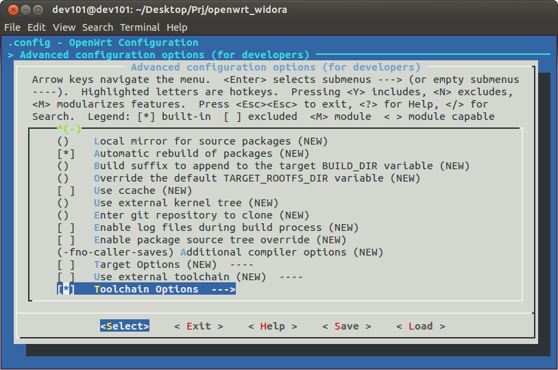

  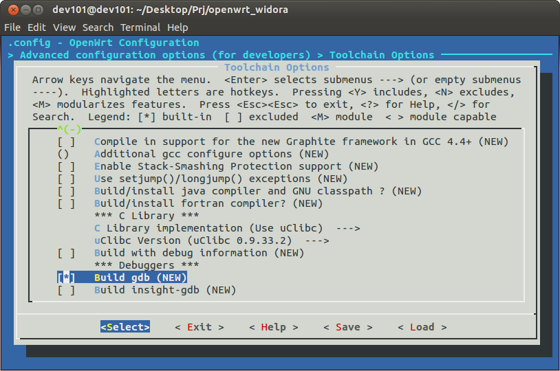

  

Execute “make toolchain/install” if it has not already been done. The purpose of this step is to prepare the cross compile toolchain and debugging gdb for us.

  

  


#### 4.1.3 Eclipse Prerequisites

Download your desired Eclipse IDE for C/C++ Developers.

For this guide, we are going to use Eclipse IDE for C/C++ Developers Eclipse Luna SR2 (4.4.2) Linux.

http://www.eclipse.org/downloads/packages/release/luna/sr2

Choose your preferred version and select platform type depends on you development OS type (32 Bit / 64 Bit).

Extract archive; place it to your preferred location/directory. Execute eclipse, select your preferred workspace location if being asked and enter workbench. **Note that you need Java Runtime to be able to run Eclipse.**

  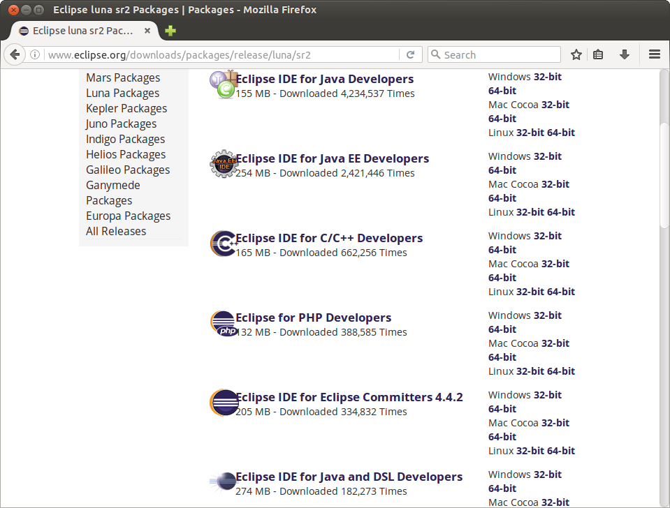

  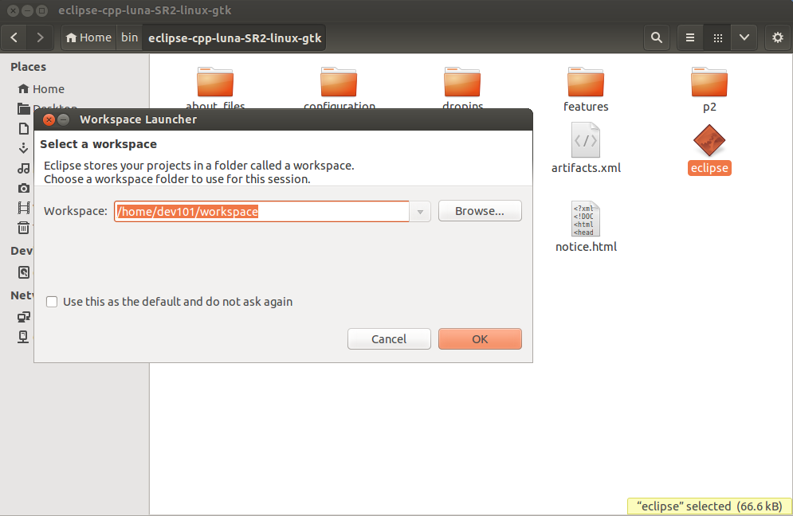

  

  


We have to install additional eclipse packages: `Help → Install new Software → All Available Sites`. And select in section **“Mobile and Device Development”** packages **“C/C++ GCC Cross Compiler Support”** and **“Remote System Explorer End-User Runtime”**.

If you are using Eclipse IDE for C/C++ Developers, most likely these two packages have already been installed. If you cannot find above two packages or want to check their status, uncheck **“Hide items that are already installed”**.

  

  


## 5 Project Setup

### 5.1 Eclipse Cross Compiler Project Setup

#### 5.1.1 Setup eclipse

Create a new project: `File → New C++ Project (resp. C project)`:

  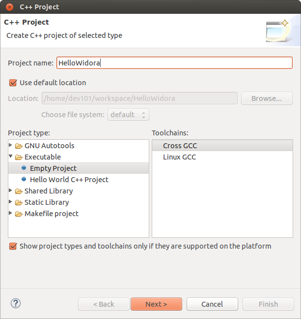

  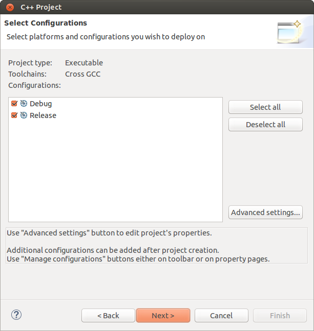

The next settings depend on your target device and where your buildroot has been installed.

You have to evaluate your specific target settings.

You need to specify your Cross GCC path and prefix.

For this guide, we
Navigate to openwrt source code trunk/root directory, and then execute `find ./staging_dir -path "./staging_dir/toolchain*" -name *openwrt-linux`

  

The system being used for this guide returned result of:

`./staging_dir/toolchain-mipsel_24kec+dsp_gcc-4.8-linaro_uClibc-0.9.33.2/mipsel-openwrt-linux`

Hence for “Cross compiler prefix” we enter `mipsel-openwrt-linux-`.

We can reuse the above finding results to get the required **absolute** full path of “Cross compiler path”:

`[YOUR_OPENWRT_TRUNK]/staging_dir/toolchain-mipsel_24kec+dsp_gcc-4.8-linaro_uClibc-0.9.33.2/`

**Don't forget to adapt these settings to YOUR specific build environment, COPY + PASTE from here may not work!**

Finally enter your specific setting and press Finish button.

  

#### 5.1.2 Eclipse Project Settings

For this guide, one simple Hello World program is going to be created to show how to setup remote target device source level debugging and remote access via eclipse.

Add src folder and source file.

`File → New Source Folder (src)`

`File → New Source File (src/HelloWidora.cpp)`

```
#include <iostream>
using namespace std;
int main()
{
	int i = 0;
	for (i=0; i<10; i++)
	{
		cout << "Hello OpenWrt" << endl;
	}
	return 0;
}
```

  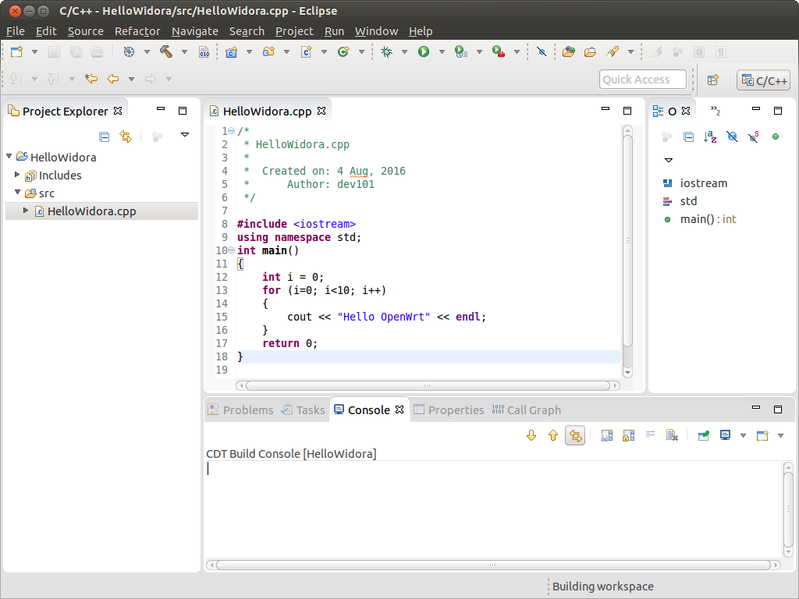

If all was configured correctly you should be able to call `Project-Build all` without errors.
But you can't execute the created bin file on your build system; remember your binary is cross compiled.

  

##### 5.1.2.1 Remote Target Setup

If you program was successfully compiled, you have to install it on your target device to execute it.

At this point Eclipse will help with nice features of remote access and remote debug, to setup remote target:

Go to `Window → Show View → Other… → Remote Systems`

  

And we create a new connection:

  

Select Linux and “Next >”:

  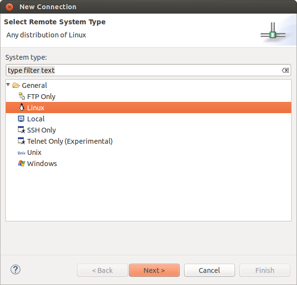

Now enter the target device's IP address resp. hostname and “Next >”.

  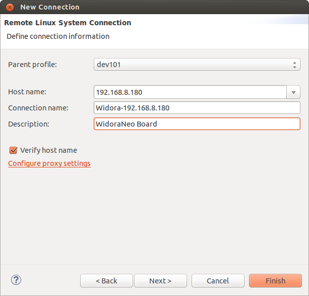

Select “ssh.files” and “Next >”.

  

Select “processes.shell.linux” and “Next >”.

  

Select “ssh.shells” and “Next >”. And then “Finish”.

  

  

Your IDE will look similar to this:

  

##### 5.1.2.2 Browse Your Target Device

  

Enter user name + password for the target device:

  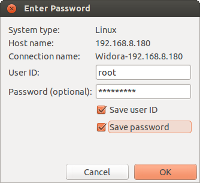

For the first time, Eclipse may ask for Secure Storage master password, set your own master password and continue:

  

  

After entering user name + password you are now able to put files on/from your target devices via drag n' drop, you can even control the target's processes:

  

Or you can enter a ssh terminal in eclipse or copy/execute HelloOpenWrt bin file on your target device:

  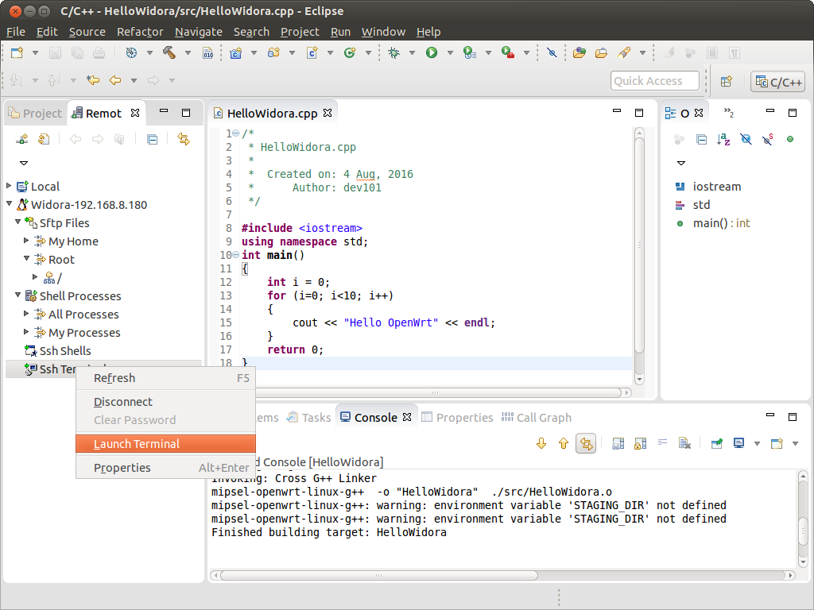

  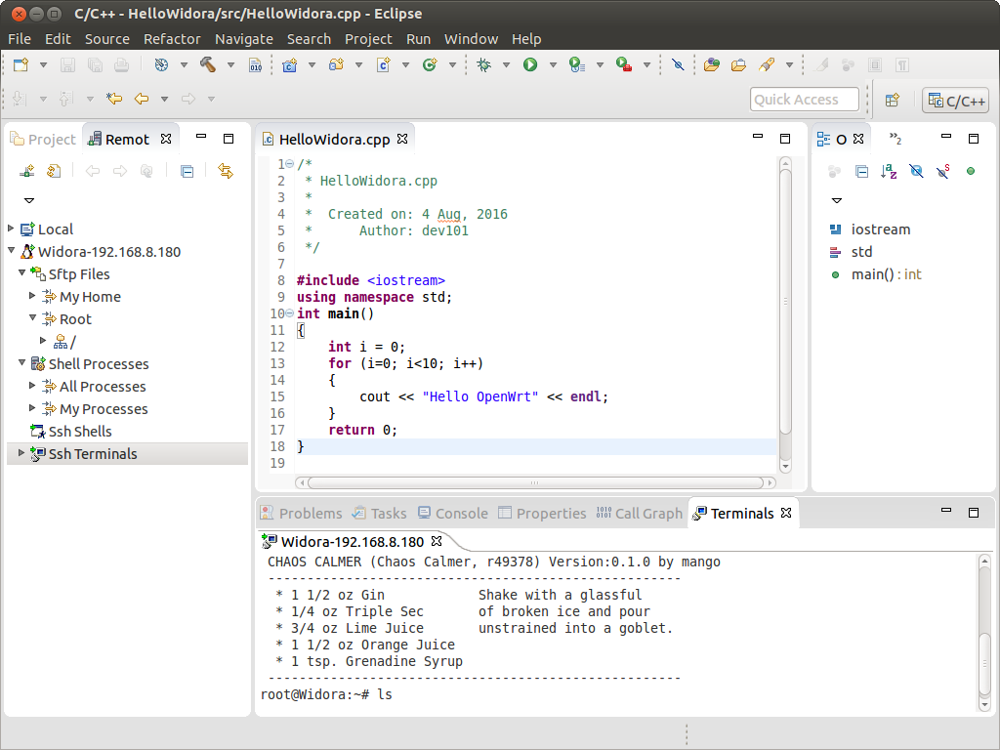

##### 5.1.2.3 Remote gdb Debugger Setup

For target device remote debugging at first we have to define a debug configuration
Left click on arrow of the “bug”-button to enter “Debug Configurations”

  

And we create a new C/C++ Remote Application Debug Configuration:

  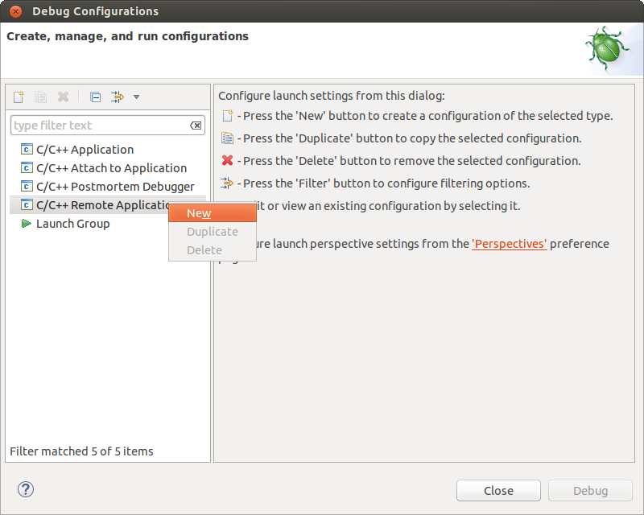

- In “Main” at C/C++ App adapt local file path to your application.
- Change at “Connection” to your already defined target device remote connection (see Remote Target Setup).
- Don't forget to define the correct “Remote Absolute File Path for C/C++ Application”

  

Now click on “Debugger” settings to define the correct host gdb file.

As host gdb we can't use the /usr/bin/gdb provided e.g. by Ubuntu, we must use the gdb which has been built by our toolchain. As well as the tool command prefix, the location depends on your specific target settings and we evaluate it again. It is located somewhere in `./build_dir`.

Execute: `find ./build_dir -executable -type f -name gdb |grep toolchain` as shown below.

The system being used for this guide returned result of:
`./build_dir/toolchain-mipsel_24kec+dsp_gcc-4.8-linaro_uClibc-0.9.33.2/gdb-linaro-7.6-2013.05/gdb/gdb`

  

We have to enter the **absolute** file path at “GDB debugger”, for the system being used for this guide is:

`/home/dev101/Desktop/Prj/openwrt_widora/build_dir/toolchain-mipsel_24kec+dsp_gcc-4.8-linaro_uClibc-0.9.33.2/gdb-linaro-7.6-2013.05/gdb/gdb`

**Remember these settings depend on YOUR specific build environment, COPY + PASTE from here may not work!!**

Other changes are not required. Now you may press “Debug” button of the settings window.

  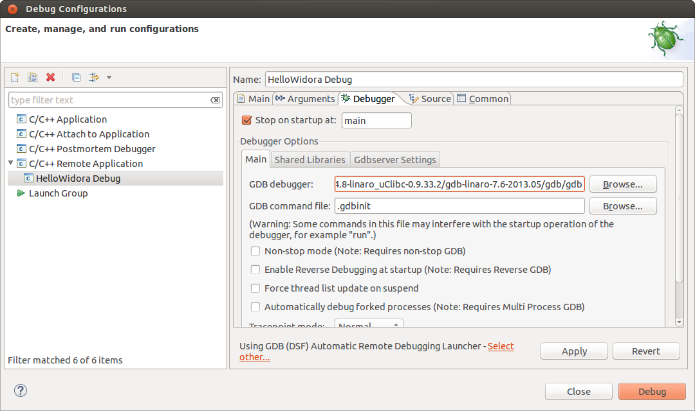

##### 5.1.2.4 Remote Debugging Example

  

When you launch Debug the Debug View of eclipse will be opened:

  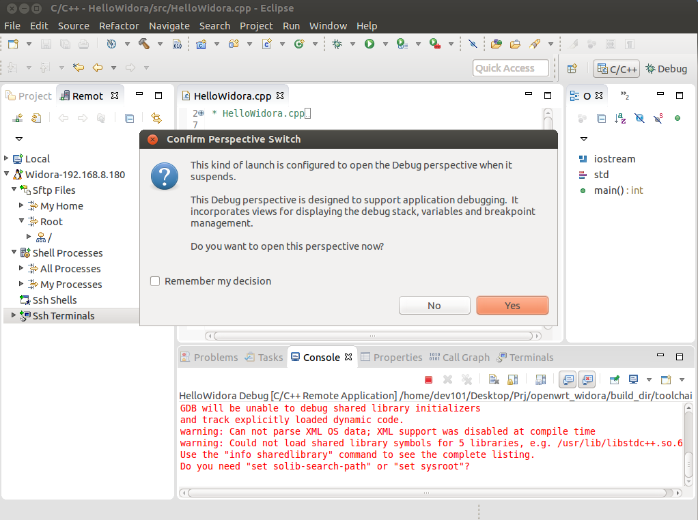

  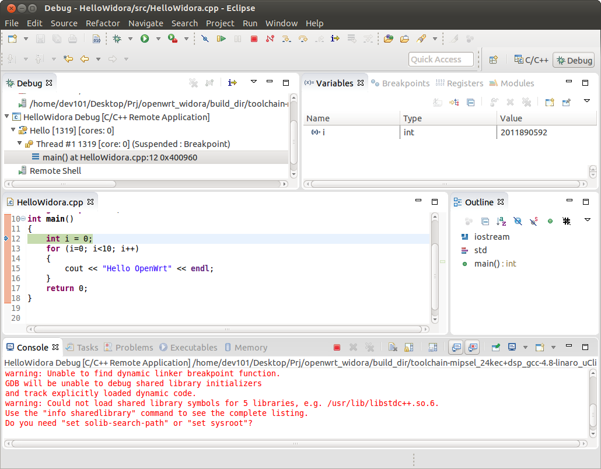

The above red color warning can be ignored since you haven't enabled `“Advanced configuration options (for developers)->Build Options->Debugging”` in OpenWrt build settings and rebuild all with debugging information for your Widora firmware.


## 6 Finish
Congratulations, now you have a complete OpenWrt Development Suite! You can develop your C/C++ program in Eclipse IDE, Cross-Compile it, set break points and do remote debugging.

  

  
