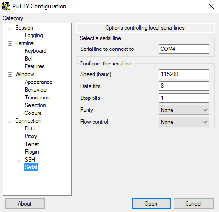
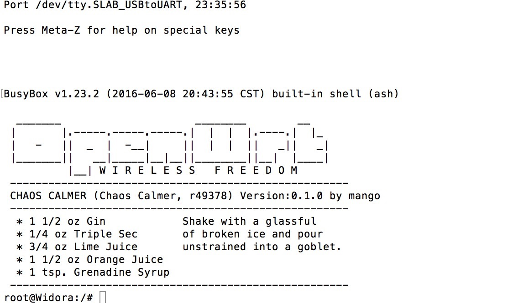
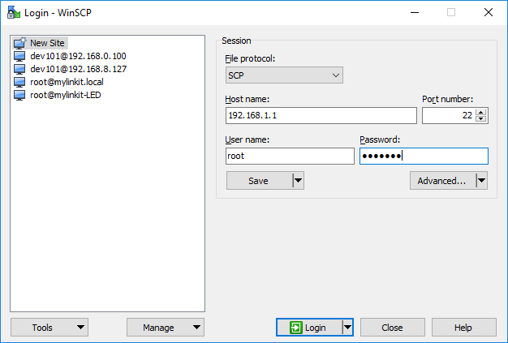
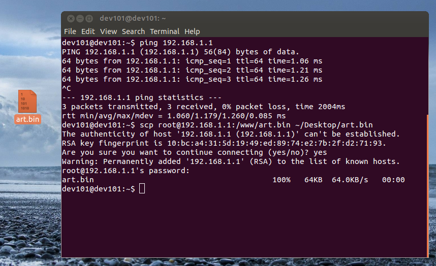

# Widora User Guide


## 1 Before Getting Started


### 1.1 Login to Widora


##### 1.1.1 Login to Widora through onboard Serial Terminal
There is USB to TTL chip CP2104 onboard, which is the MicroUSB port labeled as "USB-TTL" on the PCB, user can connect this USB port using a MicroUSB cable to PC.

Windows and macOS user may need to download and install driver for it:

Windows: http://www.silabs.com/Support%20Documents/Software/CP210x_VCP_Windows.zip

macOS: http://www.silabs.com/Support%20Documents/Software/Mac_OSX_VCP_Driver.zip
- For Windows user, it is recommended to use **"putty"** as the terminal software, set the settings of putty as described below:

  In Windows Device Manager, the COM port number can be found, and in putty software, set the **"Connection type"** to **"Serial"**, set the **"Serial line"** to the COM port you found in Windows Device Manager, set the **"Speed"** to be **115200**, then switch to "Serial" tab, set the **"Flow control"** to be **"None"**. After setting everything correctly, click "Open" and the Serial Terminal will be opened.

  Chinese Software Interface:

  

  

  English Software Interface:

  

  

- For macOS and Linuix, **"minicom"** is recommended as the Serial Terminal software, install the software, find the serial port device in the system, for example, in Linux, use command `dmesg |grep tty` in the Linux terminal to findout the serial port device. Normally the device will be /dev/ttyUSB0 for Linux and /dev/tty.SLAB_USBtoUART for macOS.
`sudo minicom -s` to setup the serial port, choose the target serial device in **"A - Serial Device"**, **E** set as **115200 8N1**, **F** set as **No**.

  

  After that, simply save setup as default and choose Exit to exit.

  After finsh configuring the serial configuration, press Enter to enter Serial Terminal.
  


##### 1.1.2 Login to Widora through SSH
We can also login to Widora wirelessly through SSH. Factory default Widora does not have password set for root user, while logging into Widora through SSH requires the login user to be password protected, so the first thing we need to do is to set the password for root user.

- For Windows user, **putty** is recommended to be used as terminal software. First of all, connect PC wireless to Widora AP with name similar to **"Widora-XXXX"**, after connect successfully, open putty software, choose **"Telnet"** as the **"Connection type"**, enter IP address **"192.168.1.1"** and press **"Open"**.

  

  You will login to the Widora (***You may also noticed that at the top, there is IMPORTANT notification asking user to use `passwd` command to set the login password, and it will disable telnet and enable SSH***)

  

  Enter `passwd` command, follow the instruction to set the password. And after setting password successfully, use command `exit` to exit Telnet.

  

  Remember in the previous step, after setting the password, telnet is disabled and SSH is enabled. So from now on, we can use SSH to connect to Widero. Reopen putty software, set the **"Connection type"** as **SSH**, enter the IP address **192.168.1.1**, press Open to login to the SSH terminal.

  

  For the first time, follwoing window will pop up, click "Yes" to accept the RSA2 key.

  

  Following the instruciton to key in the user name and passowrd, and you are ready to go.

  


### 1.2 Backup ART


##### 1.2.1 Why we need to backup ART
Each router hardware, the hardware parameters are different, in order to have unified performance, a calibration process is needed, and calibration file will be generated after the calibration process, so the calibration file for each board is unique. All the Widora board have been calibrated out of factory, in order to prevent loss of the ART data, please backup your ART partition.


##### 1.2.2 How to backup ART through Serial Terminal
- Login to the Serial Terminal, enter command `cat /proc/mtd`
```
root@Widora:/# cat /proc/mtd
dev:    size   erasesize  name
mtd0: 00030000 00010000 "u-boot"
mtd1: 00010000 00010000 "u-boot-env"
mtd2: 00010000 00010000 "factory"
mtd3: 00fb0000 00010000 "firmware"
mtd4: 00119d29 00010000 "kernel"
mtd5: 00e962d7 00010000 "rootfs"
mtd6: 00aa0000 00010000 "rootfs_data"
```
- Partition with name "Factory" is where your ART data stored, using `dd` command to back it up to a file. `dd if=/dev/mtd2 of=/www/art.bin`
```
root@Widora:/# dd if=/dev/mtd2 of=/www/art.bin
128+0 records in
128+0 records out
root@Widora:/#
```
- Connect your computer to the Widora network, enter below address in your computer browser to browse the file: "http://192.168.1.1/art.bin", a window will automatically pop up in your browse asking for download, download the file and keep it in a safe place, you may need to restore it if you mess up and lost the ART.


##### 1.2.2 How to backup ART through SSH Terminal
First of all, make sure you can login to Widora SSH termianl as described above **"Login to Widora through SSH"**. after logging into the SSH termial, similar to what you do in Serial Terminal as described above, use `cat /proc/mtd` command in the SSH Termial to check the partition number of ART partition, then use `dd` command to backup the ART partition as a file.

After that, you can browse "http://192.168.1.1/art.bin" in your computer browser to download the file.
You can also use other ways to get this file:

- For Windows user, you can use **WinSCP** software to browse the filesystem of Widora.

  WinSCP can be downloaded from: https://winscp.net/eng/download.php

  Install and open the software, choose **"New Site"**, choose **SCP** as the **"File protocol"**, enter the IP address **192.168.1.1** as the **"Host Name"**, enter the **[User name]** and **[Password]**. Press **Login** to login.

  

  For the first time, follwoing window will pop up, click "Yes" to accept the RSA2 key.

  

  After login, you can browse Widora filesystem. Find the ART file created previously, and download it to the computer and keep it safe.

  

- For Linux user, `scp` command can be used to greb files in Widora. Use `ping` command to make sure Widora is reachable, then use command `scp root@192.168.1.1:/www/art.bin ~/Desktop/art.bin` , follow the instructions and save the ART file to the Desktop of the Linux computer.

  
