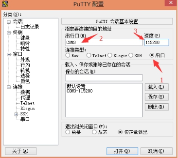
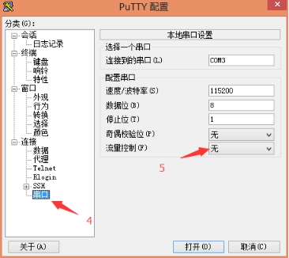
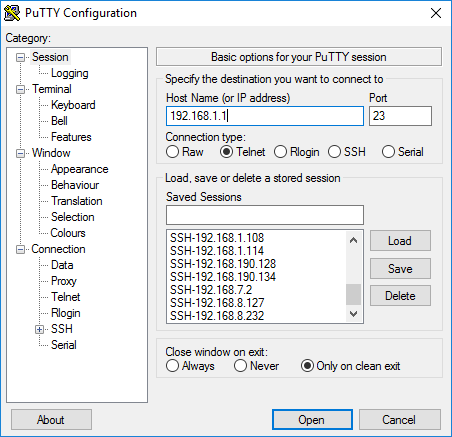
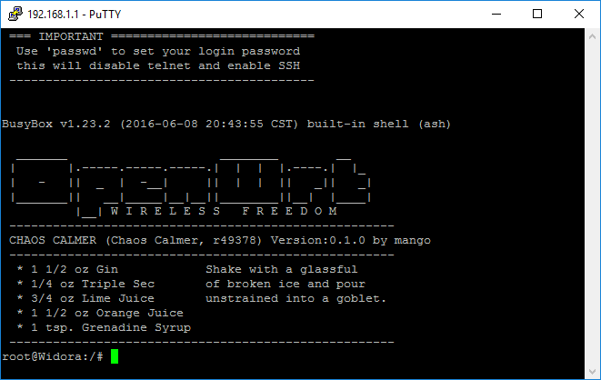
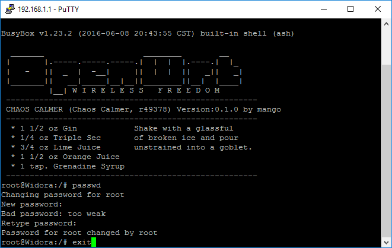
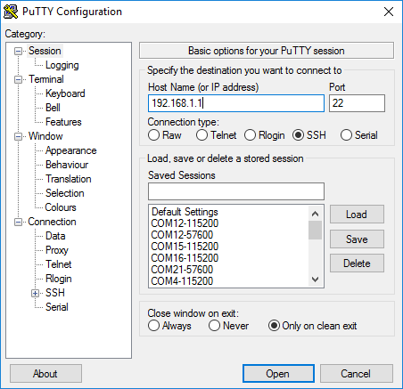
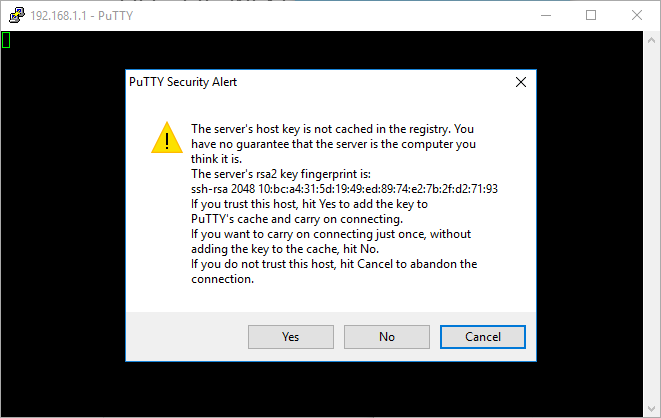
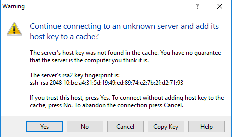
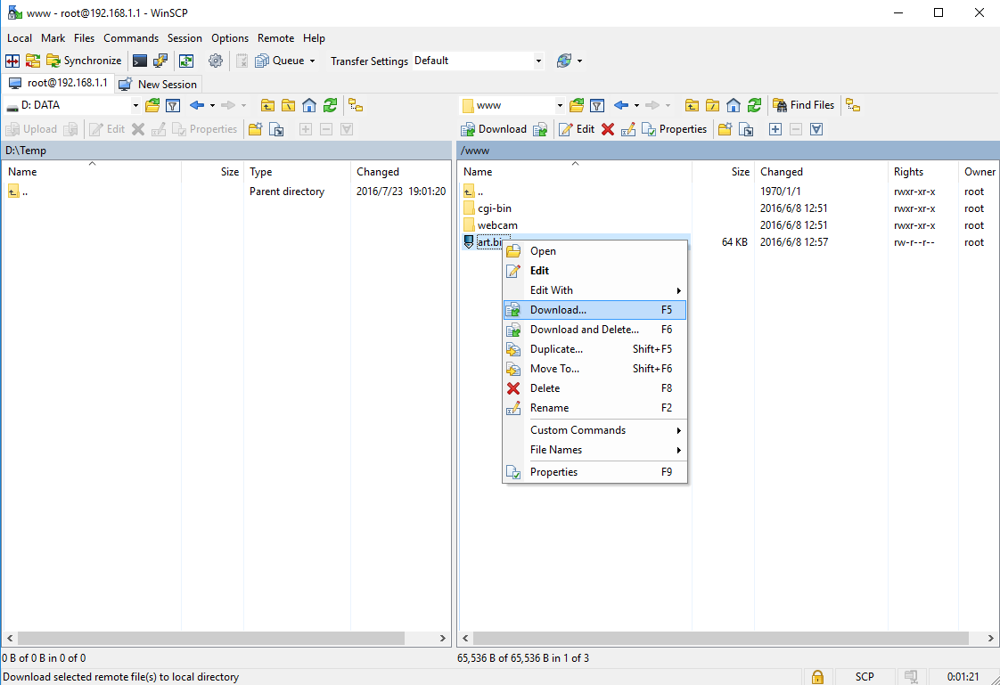

# Widora 用户指南


## 1 开始之前


### 1.1 登录Widora


##### 1.1.1 串口登录Widora
Widora板载了USB转TTL调试芯片CP2104，调试串口是丝印为“USB-TTL”的MicroUSB接口，可以通过一根MicroUSB线缆连接到PC即可。

- Windows和macOS用户可能需要下载对应的驱动 ：

  Windows: http://www.silabs.com/Support%20Documents/Software/CP210x_VCP_Windows.zip

  macOS: http://www.silabs.com/Support%20Documents/Software/Mac_OSX_VCP_Driver.zip

- Windows用户建议使用putty终端，putty设置如下：

  任务管理器中查看串口号，再到putty中设置串口速度115200，串口标签页中将流量控制设置为“无”即可。

  

  

- macOS和Linux建议自行安装minicom，安装完设置步骤如下:

  查看串口设备，Linux内一般是/dev/ttyUSB0，macOS一般是/dev/tty.SLAB_USBtoUART。设置minicom，”$ sudo minicom -s”,选择Serial port setup后，将A设置为对应的串口设备，E设置为115200 8N1，F设置为No。

  

  设置好后选择“Save setup as dfl”保存配置，选择Exit退出设置即可。

- 设置完后敲回车，进入串口控制台。

  


##### 1.1.2 无线登录Widora
除了通过板载串口登录Widora，还可以通过SSH无线登录Widora，Widora出厂是没有设置root用户密码的，所以首先我们需要设置root用户密码，然后才可以通过SSH登录Widora。具体步骤如下：

- Windows用户建议使用putty终端，首先连接PC无线到AP“Widora-XXXX”，连接成功之后，打开putty，选择Telnet连接方式，输入IP地址“192.168.1.1”连接。

  

  进入如下界面（注意在窗口的顶部可以看到提示说用`passwd`命令设置登录密码，设置之后Telnet会被禁用，而SSH会被启用）。

  

  输入`passwd`命令，按照提示设置密码。设置完成之后`exit`命令退出Telnet登录。

  

  重新打开putty，选择SSH连接方式，输入IP地址“192.168.1.1”连接。

  

  对于第一次连接，会有窗口弹出，选择“是”接受RSA2密匙。

  

  按照提示输入登录用户名和密码，回车登录。

  


### 1.2 备份ART


##### 1.2.1 为什么要备份无线校准文件？
每一个路由器硬件，无线部分的硬件参数都是不同的，为了让不同的硬件参数都发挥出统一的性能，就需要一个校准过程，校准后会生成一个校准文件，所以每个板子的校准文件都是独一无二的。Widora出厂都已校准完毕，以防用户丢失ART数据，请自行导出保存。


##### 1.2.2 通过板载串口终端备份无线校准文件
- 进入串口终端，输入`cat /proc/mtd`
```
root@Widora:/# cat /proc/mtd
dev:    size   erasesize  name
mtd0: 00030000 00010000 "u-boot"
mtd1: 00010000 00010000 "u-boot-env"
mtd2: 00010000 00010000 "factory"
mtd3: 00fb0000 00010000 "firmware"
mtd4: 00119d29 00010000 "kernel"
mtd5: 00e962d7 00010000 "rootfs"
mtd6: 00aa0000 00010000 "rootfs_data"
root@Widora:/#
```
- 这里看到的"factory"就是ART数据文件了，使用`dd`命令即可备份到一个文件中。“dd if=/dev/mtd2 of=/www/art.bin”。 `dd if=/dev/mtd2 of=/www/art.bin`
```
root@Widora:/# dd if=/dev/mtd2 of=/www/art.bin
128+0 records in
128+0 records out
root@Widora:/#
```
- 通过网络访问Widora，浏览器中输入地址：“http://192.168.1.1/art.bin” 后，会自动弹出下载对话框，下载到电脑即可。


##### 1.2.3 通过SSH终端备份无线校准文件
首先确保可以SSH无线登录终端，详见**“无线登录Widora”**。SSH登录终端之后，和通过板载串口终端类似，在SSH终端输入`cat /proc/mtd`查看ART分区，然后使用`dd`命令即可备份到一个文件中。

之后也可以通过浏览器打开“http://192.168.1.1/art.bin” 后，会自动弹出下载对话框，下载到电脑即可。

- 对于Windows用户，也可以通过WinSCP软件浏览Widora文件系统。

  WinSCP软件下载地址： https://winscp.net/eng/docs/lang:chs#下载

  安装WinSCP之后打开软件，选择新建站点，选择SCP，输入IP地址192.168.1.1，输入用户名和密码，点击登录。

  

  首次登录软件会弹出窗口，点击“是”接受RSA2密匙。

  

  登录之后，用WinSCP就可以自由浏览Widora的文件系统了。找到之前生成的ART文件，下载到本地PC保存。

  

- Linux用户，可以通过scp命令获取Widora上的文件。`ping`一下“192.168.1.1”确保可以连接到Widora，然后输入`scp root@192.168.1.1:/www/art.bin ~/Desktop/art.bin`， 按照提示，把ART文件保存到Linux电脑的桌面上。

  
